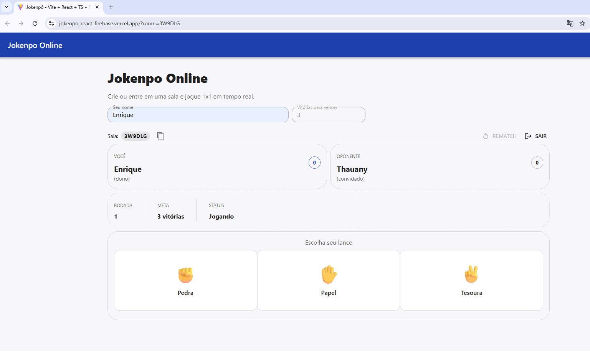

# 🕹️ Jokenpo Online (React + MUI + Firebase)

Jogue Pedra, Papel e Tesoura online com amigos em tempo real. Projeto desenvolvido em React com Vite, usando Material UI e Firebase Firestore como backend.

 <!-- substitua se desejar -->

---

## 🚀 Funcionalidades

- ✅ Criar e entrar em salas usando código (ex: `4FJD7N`)
- ✅ Jogo 1x1 online, com placar e vitórias acumuladas
- ✅ Link de convite com `?room=XXXXXX`
- ✅ Interface responsiva com Material UI
- ✅ Firebase Firestore para sincronização em tempo real
- ✅ Revanche, sair da sala e auto limpeza de estados

---

## 📦 Tecnologias utilizadas

- ⚛️ React + Vite
- 🧱 Material UI (MUI)
- 🔥 Firebase Firestore
- 🌐 Deploy com Vercel

---

## 🛠️ Como rodar localmente

### 1. Clone o projeto

```bash
git clone https://github.com/enriquecintra/JokenpoReactFirebase.git
cd JokenpoReactFirebase
```

### 2. Instale as dependências

```bash
npm install
```

### 3. Configure o Firebase

Crie um projeto no [Firebase Console](https://console.firebase.google.com/) e ative o **Firestore**.

Depois, crie um arquivo `.env` com as seguintes variáveis:

```env
VITE_FIREBASE_API_KEY=your_key
VITE_FIREBASE_AUTH_DOMAIN=your_project.firebaseapp.com
VITE_FIREBASE_PROJECT_ID=your_project_id
```

⚠️ Certifique-se de liberar regras mínimas de segurança em Firestore para testes:

```js
rules_version = '2';
service cloud.firestore {
  match /databases/{db}/documents {
    match /rooms/{roomId} {
      allow read, write: if true; // apenas para testes
    }
  }
}
```

### 4. Rode o projeto

```bash
npm run dev
```

---

## 🌍 Deploy com Vercel

1. Crie uma conta em [https://vercel.com](https://vercel.com)
2. Suba o projeto para o GitHub
3. Clique em **"New Project"** e importe o repositório
4. Adicione as mesmas variáveis `.env` no painel de configurações
5. Build command: `vite build`
6. Output directory: `dist`
7. Clique em **Deploy**

---

## 🧩 Estrutura do Projeto

```
├── public/
├── src/
│   ├── assets/         # SVGs e imagens
│   ├── components/     # Componentes reaproveitáveis
│   │   └── MoveCard.tsx
│   ├── pages/          # Páginas de rota
│   │   └── Game.tsx
│   ├── services/       # Firebase config
│   │   └── firebase.ts
│   ├── types/          # Tipagens auxiliares
│   │   └── game.ts
│   ├── theme.ts        # Customização do MUI Theme
│   ├── main.tsx        # Entry point com BrowserRouter
│   └── App.tsx         # Definições de rotas
└
```

---

## 🙋‍♂️ Sobre o projeto

Este projeto foi criado com foco em aprendizado, testes de sincronização com Firebase e práticas modernas com React/MUI/Vite. Código limpo, responsivo e ideal para projetos didáticos ou MVPs.

---

## 📄 Licença

MIT — sinta-se livre para usar, melhorar e compartilhar.

---

> Feito com 💙 por [Enrique Cintra de Sousa](https://www.linkedin.com/in/enrique-cintra)
